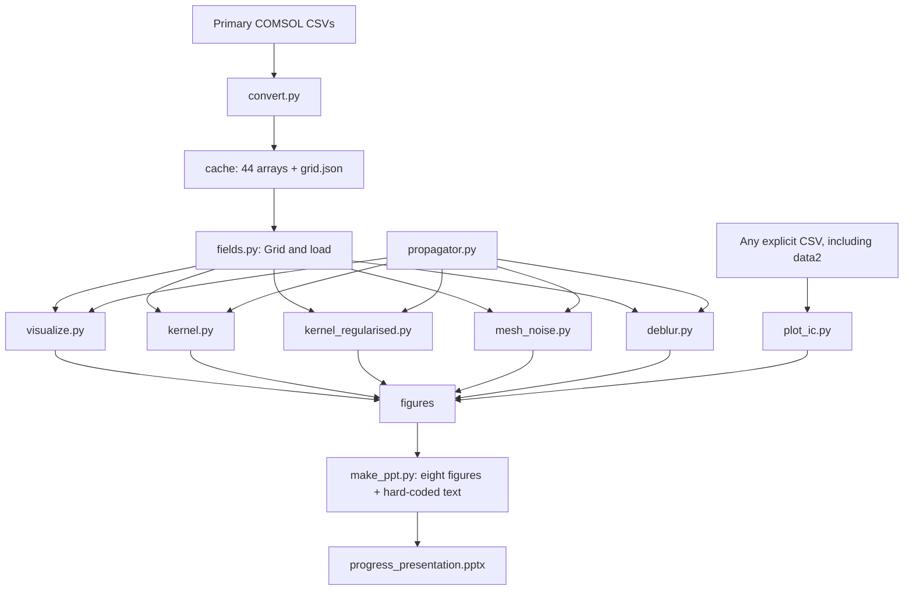

# Codebase Understanding

Investigation date: 23 September 2026. Repository: `learning_ker`. Inspected revision: `d8454034b09cbeb5f2313c829f50368cf9ce0522`, with a clean working tree before this document was added.

Evidence labels used below:

- **Verified**: established from implementation, full data inspection, stored artifacts, Git history, or a bounded numerical check.
- **Inference**: an interpretation supported by evidence, but not independently established.
- **Unknown**: information the repository does not preserve.

Scope: all 10 Python files, four existing Markdown files, both Git commits, all 20 CSVs, all 44 cached arrays, grid metadata, all 93 PNGs (contact-sheet inspection plus detailed inspection of key results), and the 22-slide PowerPoint were inspected. The raw-data audit read all 39,200,000 records. Numerical checks called functions directly without saving plots or running full experiment entry points. No application code, existing data, or existing results were changed. No full deblurring run was launched; in particular, the saved 2,000-iteration experiment was not rerun.

## 1. Executive Summary

This is a small scientific research repository studying how magnetic-field maps become smoother with increasing distance above a simulated micro-coil. It starts with COMSOL exports, converts them into image-shaped NumPy arrays, compares field propagation with an analytic Fourier operator, learns empirical blur kernels, and attempts to reconstruct the closest available field plane from a more distant one.

The primary dataset contains 11 heights from 0.5 to 10 µm, each with Bx, By, Bz and field magnitude on a 1400 × 1400 grid. A separate collection of nine interconnect exports exists under `data/data2`; it is only accessible through the standalone CSV plotting workflow, not the main cache loader.

There is no neural network, service, application UI, training framework, notebook, or packaged experiment system. “Learning” means closed-form least squares at each Fourier frequency. The current inverse solver is iterative shrinkage-thresholding (ISTA) with an **L1 penalty on field values**. A previous committed solver used a TV-like proximal iteration and Wiener-regularised kernels; its outputs and documentation remain alongside current results.

The strongest reproducible result is that fitting a shared kernel across Bx, By and Bz makes repeated forward propagation much more stable than fitting each component independently. At the held-out 2 µm height, the current joint Wiener implementation gives 0.809%, 0.858%, and 0.906% range-normalised RMSE, versus 0.728%, 0.743%, and 0.718% for the analytic baseline. These measure interpolation across height on one simulated geometry, not generalisation to new geometries.

The current saved L1 reconstruction reports 1.62%, 1.52%, and 1.89% at z=3 → 0.5 µm, using 2,000 iterations. Its kernel was fitted using the same reference images subsequently treated as ground truth. Those results demonstrate reconstruction with reference-assisted operator identification; they do not establish blind recovery of an unseen source field.

The main risks before extending the repository are weak experiment provenance, mixed historical/current documentation, whole-image range-normalised evaluation, finite-domain FFT boundary assumptions, and data identity being reduced to height in the cache filenames.

## 2. Repository Map

```text
learning_ker/
├── .git/                         two commits; source and generated artifacts tracked
├── .gitignore                    ignores data/ only
├── .DS_Store                     macOS metadata
├── data/                         ignored, locally present raw COMSOL exports
│   ├── L1_C1_Z*p*um_600uA_0p1PR_MF_B.csv     11 primary coil planes
│   └── data2/
│       ├── IC_2um_Z{1,2}p0um_600uA_0p1PR__MF.csv
│       └── IC_4um_Z{0p5,3p0,4p0,5p0,6p0,7p0,10p0}um_600uA_0p1PR__MF.csv
├── cache/
│   ├── grid.json                 shared primary-grid metadata
│   └── z{00.5,01.0,...,10.0}_{Bx,By,Bz,Bnorm}.npy  44 float32 arrays
├── scripts/
│   ├── convert.py                raw CSV → cache
│   ├── fields.py                 cache API and grid geometry
│   ├── propagator.py             analytic propagation and spectral helpers
│   ├── visualize.py              primary-data overview/diagnostic plots
│   ├── plot_ic.py                standalone plot of any one CSV
│   ├── kernel.py                 unregularised joint kernel experiment
│   ├── kernel_regularised.py     Wiener joint kernel experiment
│   ├── mesh_noise.py             analytic residuals for all height pairs
│   ├── deblur.py                 current padded L1 ISTA inverse experiment
│   └── __pycache__/              three tracked CPython 3.13 bytecode files
├── figures/                      49 top-level PNGs plus macOS metadata
│   └── planes/                   44 single-plane PNGs
├── make_ppt.py                   manually authored presentation generator
├── progress_presentation.pptx    generated 22-slide presentation
├── info.md                       historical discussion, proposals, interpretations
├── res.md                        manually recorded kernel holdout table
├── kernel_learning_summary.md   narrative of kernel experiments
├── ista_deblurring_summary.md   historical TV solver description
└── CODEBASE_UNDERSTANDING.md     this investigation
```

### Important files and their status

| File / family | Role and classification |
|---|---|
| `scripts/convert.py` | Active source of truth for primary CSV parsing, grid inference and float32 cache creation. It reads only CSVs directly inside `data/`, not subdirectories. |
| `scripts/fields.py` | Foundational source of truth for paths, cache naming, units and array orientation. `Grid`, `grid()`, `z_values()` and `load()` are used throughout the experiments. |
| `scripts/propagator.py` | Foundational numerical helpers: Fourier frequency grid, exponential transfer, propagation, Hann spectra and radial binning. It contains no fitted model or padding implementation. |
| `scripts/visualize.py` | Active plotting source, producing ten overview/diagnostic PNGs or 44 individual planes. Importing it also changes global Matplotlib style. |
| `scripts/plot_ic.py` | Separate active CSV plotting entry point; bypasses the cache and duplicates part of conversion logic. It is the only current path that can directly inspect `data/data2`. |
| `scripts/kernel.py` | Active unregularised joint-fit experiment with one withheld height. The retained single-component fitting function and commented-out loop are legacy alternatives. |
| `scripts/kernel_regularised.py` | Active joint ridge/Wiener experiment using one scalar penalty derived from reference Bz. It duplicates kernel application, error calculation and substantial plotting code from `kernel.py`. |
| `scripts/mesh_noise.py` | Active all-pairs analytic residual experiment for Bz. Its interpretation of all residuals as mesh noise is stronger than the calculation supports. |
| `scripts/deblur.py` | Current inverse experiment; independently learns a padded joint kernel and runs L1 ISTA. It does not import the kernels from either kernel experiment. |
| `make_ppt.py` | Active document-generation source with hard-coded narrative, numbers and speaker notes. It consumes eight existing figures, never recomputes science. |
| `data/*.csv` | Primary externally generated inputs, serving as the local data source of truth. The originating `.mph` model is not present. |
| `data/data2/*.csv` | Secondary externally generated inputs. Scientifically distinct from the coil data; intended relationship between `IC_2um` and `IC_4um` is uncertain. |
| `cache/*.npy`, `cache/grid.json` | Generated intermediate artifacts and the immediate inputs to all primary experiments. Every array was verified against its raw source after the exact float32 cast. |
| `figures/*.png`, `figures/planes/*.png` | Generated outputs from several generations of experiments; not machine-readable predictions or model checkpoints. Detailed provenance is in §12. |
| `progress_presentation.pptx` | Generated historical communication artifact. Its eight embedded PNGs match current figure files byte-for-byte, but its text includes unsupported and stale claims. |
| `info.md` | Historical discussion and proposed work; contradictory statements appear within the file. It is not executable configuration or authoritative current documentation. |
| `res.md` | Human-written result table; joint/regularised results agree with calculations, but the unregularised per-component row disagrees with both its PNG and recomputation. |
| `kernel_learning_summary.md` | Useful narrative of experiment evolution; numerical results need cross-checking and some causal explanations are incorrect. |
| `ista_deblurring_summary.md` | Legacy documentation corresponding broadly to the initial-commit TV solver. Current CLI and objective differ. |
| `.DS_Store`, `figures/.DS_Store`, `scripts/__pycache__/*` | Incidental OS/runtime artifacts. Bytecode is not a source of truth and was not used to reconstruct the current algorithm. |

Absent categories: no dependency manifest or lockfile, README, notebooks, test suite, CI configuration, shell runner, configuration YAML/TOML, logs, metric CSV/JSON exports, prediction arrays, saved learned kernels, model checkpoints, or COMSOL model/mesh files. `cache/grid.json` is data metadata, not an experiment configuration. No applicable `AGENTS.md` was found.

## 3. System Architecture



`plot_ic.py` imports colour constants from `visualize.py` and `ROOT`/component conventions from `fields.py`, but it does not call the cache loader. Its extra imports do not make it part of the primary data pipeline.

The dependency graph is shallow: scripts import `fields` and `propagator`, not one another's fitted models. `deblur.py`'s dependence on `propagator` is for spectral plots; its learned forward operator does not use the analytic exponential. `convert.py` does not import `fields.py`, so their height naming and component conventions are duplicated.

Data structures are plain NumPy arrays and dictionaries. Fields are indexed `[row=y, column=x]`. Fitted kernels are complex arrays in **unshifted FFT layout**, keyed by `dz` in the two kernel experiments. Results and histories exist only in local dictionaries/lists before being plotted or printed.

Shared state includes `fields.ROOT`, `CACHE`, `FIGURES`, `COMPONENTS`, cached metadata and cached arrays. `grid()` and `z_values()` each have a one-entry LRU cache; `load()` has 64 entries keyed by its call arguments. Returned arrays are mutable, so in-place changes by a future caller would alter subsequent reads. Changing files during a long-lived process does not invalidate these caches.

There is no dependency injection or run configuration object. Reference height, component list, holdout height and diagnostic constants are module globals; only `deblur.py` has a real argparse configuration interface. Several scripts insert their own directory into `sys.path`. Running a script directly, for example `python scripts/kernel.py`, makes the same local modules importable without package installation.

## 4. Execution Flow

Run the following from the repository root. Paths inside the primary scripts are resolved relative to their source files, so absolute script paths also work from another directory. The CSV argument to `plot_ic.py` is resolved relative to the caller's working directory.

| Workflow / command | Actual execution and outputs |
|---|---|
| `python3 scripts/convert.py` | `main()` → `data/*.csv`, sorted by filename height → `convert_one()` → pandas → `infer_grid()` → save four arrays per plane → cross-plane metadata validation → `cache/grid.json`. Existing matching cache files are overwritten. |
| `python3 scripts/fields.py` | `summary()` → cached arrays → per-height/component peaks and RMS → stdout only. |
| `python3 scripts/visualize.py` | `main()` → metadata/load → six diagnostic functions and four montages → ten top-level PNGs. Creates `figures/`. |
| `python3 scripts/visualize.py planes` | `main()` takes the `planes` branch → `fig_planes()` → 44 PNGs in `figures/planes/`; skips other plots. |
| `python3 scripts/kernel.py` | Load z=0.5 and each eligible target → joint per-frequency fit for nine gaps → training NRMSE → four joint-kernel figures, including z=2 holdout. |
| `python3 scripts/kernel_regularised.py` | Estimate scalar lambda from z=0.5 Bz → joint Wiener fit for the same nine gaps → train/holdout NRMSE → four regularised joint figures. |
| `python3 scripts/mesh_noise.py` | Enumerate all 55 ordered lower-to-higher Bz height pairs → analytic propagation → residual/NRMSE → stdout plus four figures. |
| `python3 scripts/deblur.py --z 3.0 --n_iter 100 --lambda_ista 1e-4 --pad 32` | Load reference and target Bx/By/Bz → learn padded kernel internally → forward diagnostic → ISTA per selected component → ground-truth NRMSE → four `deblur_ista_l1_z3*` figures. |
| `python3 scripts/plot_ic.py data/data2/IC_4um_Z0p5um_600uA_0p1PR__MF.csv` | Direct CSV parse → grid/µT planes → four-panel overview named from the input stem. Creates `figures/`. |
| `python3 make_ppt.py` | `build()` → 22 manually composed slides + eight existing PNGs → `progress_presentation.pptx`. |

`propagator.py` defines helpers only; executing it does not start an experiment. All other Python files have `if __name__ == '__main__'` entry points.

Only conversion is a prerequisite for a missing cache. The kernel and deblurring workflows do **not** need to run in sequence; all separately consume the cache. On this checkout the cache and figures already exist. Kernel, mesh and deblur scripts assume `figures/` exists, unlike the plotting entry points that create it.

No project-specific environment variables or credentials are read. Runtime requirements inferred from imports are Python, NumPy, pandas and Matplotlib; presentation generation additionally needs `python-pptx` and Pillow. Plotting uses the noninteractive Agg backend and saves files without opening windows. Optional `MPLCONFIGDIR` and `XDG_CACHE_HOME` can direct plotting caches to writable locations.

## 5. Data

### 5.1 Schema and record meaning

All 20 CSVs have nine `%` metadata/header lines followed by exactly **1,960,000 rows × six numeric columns**. The header identifies COMSOL **5.5.0.359**, dimension 2, four expressions, length unit µm and field unit T. pandas reads the numeric block as float64 during inspection/conversion.

| Column index | Export header | Code name | Meaning / downstream use |
|---|---|---|---|
| 0 | `cpl1x` | `x` | Horizontal coordinate in µm; grid width, origin and spacing, then plotting coordinates/frequencies. Not fed to regression as a feature vector. |
| 1 | `cpl1y` | `y` | Vertical coordinate in µm; determines row breaks, origin and spacing. |
| 2 | `mf.Bx (T)` | `Bx` | Signed x magnetic-flux-density component; joint fit input, forward target and optional reconstruction target. |
| 3 | `mf.By (T)` | `By` | Signed y component, same roles. |
| 4 | `mf.Bz (T)` | `Bz` | Signed z component, same roles plus noise-penalty estimate, mesh residual analysis and most diagnostic selection. |
| 5 | `mf.normB (T)` | `Bnorm` | Nonnegative vector magnitude; visualisation/statistics only in standard workflows. It is not a fourth independent linear component. |

A representative first primary record, from z=0.5, is approximately:

```text
x=-41.95 µm, y=-38.95 µm
Bx=1.12006905e-8 T, By=3.49230713e-10 T,
Bz=1.58990270e-6 T, |B|=1.58994220e-6 T
```

It is one simulated field sample at the lower-left grid coordinate at the filename's height. It becomes pixel `[0,0]`, with Bz approximately 1.5899 µT. It is not a separate measurement subject or labelled training example.

Height is absent from numeric rows and parsed from `_Z<number>p<number>um_` in the filename. `600uA` suggests a 600 µA drive and `0p1PR` corresponds to the verified 0.1 µm sampling pitch; the code does not parse these tokens or verify simulation current. Model geometry/drive claims beyond the header remain externally supplied context.

### 5.2 Primary coil dataset

Source model header: `Multilayer_square_coil_2um_4um_3L_4_COILS.mph`. Export timestamps span 25 August 2026, 20:02–20:08. These are export metadata, not a time-series variable. Source-model geometry is not available for independent verification.

Every primary file matches this exact template:

`data/L1_C1_Z{token}um_600uA_0p1PR_MF_B.csv`

| z (µm) | Filename token | Decimal MB | Peak absolute Bz (µT) | RMS Bz (µT) |
|---:|---|---:|---:|---:|
| 0.5 | `0p5` | 234.01 | 215.1441 | 22.9272 |
| 1 | `1p0` | 239.24 | 142.8107 | 17.0572 |
| 2 | `2p0` | 239.68 | 109.9174 | 10.2189 |
| 3 | `3p0` | 239.70 | 49.0880 | 6.6122 |
| 4 | `4p0` | 241.36 | 30.7654 | 4.4681 |
| 5 | `5p0` | 239.28 | 21.5190 | 3.1324 |
| 6 | `6p0` | 239.52 | 16.6045 | 2.2818 |
| 7 | `7p0` | 239.19 | 11.1503 | 1.7181 |
| 8 | `8p0` | 236.08 | 8.1931 | 1.3336 |
| 9 | `9p0` | 239.69 | 8.1118 | 1.0589 |
| 10 | `10p0` | 236.24 | 4.9479 | 0.8577 |

Total: 21,560,000 records and 2,623,995,265 bytes (2.624 decimal GB). The 44 `.npy` arrays each occupy 7,840,128 bytes; cache including JSON is 344,966,005 bytes (~345 MB or 329 MiB), not the 260 MB claimed in older prose.

Pixel centres: x = −41.95 … 97.95 µm; y = −38.95 … 100.95 µm. `Grid.extent` describes pixel edges: x = −42 … 98, y = −39 … 101. There are 1400 samples per axis at 0.1 µm spacing. FFT physical period is 140 µm, while first-to-last sample separation is 139.9 µm.

### 5.3 Secondary interconnect dataset

All nine files have model header `interconnects_F.mph`, exported on 10 September 2026. They share a different coordinate window: x centres −119.95 … 19.95 µm, y centres −74.95 … 64.95 µm, pixel-edge extent [−120,20] × [−75,65]. All are again 1400 × 1400 at 0.1 µm.

Paths below are relative to `data/data2/`:

| Filename | Decimal MB | Peak absolute Bz (µT) | RMS Bz (µT) |
|---|---:|---:|---:|
| `IC_2um_Z1p0um_600uA_0p1PR__MF.csv` | 228.57 | 140.1932 | 24.4082 |
| `IC_2um_Z2p0um_600uA_0p1PR__MF.csv` | 233.94 | 135.6274 | 16.0949 |
| `IC_4um_Z0p5um_600uA_0p1PR__MF.csv` | 228.56 | 196.1136 | 31.6179 |
| `IC_4um_Z3p0um_600uA_0p1PR__MF.csv` | 229.10 | 101.0953 | 11.7898 |
| `IC_4um_Z4p0um_600uA_0p1PR__MF.csv` | 234.13 | 64.8271 | 9.1109 |
| `IC_4um_Z5p0um_600uA_0p1PR__MF.csv` | 229.06 | 30.6599 | 7.2793 |
| `IC_4um_Z6p0um_600uA_0p1PR__MF.csv` | 232.92 | 20.2864 | 5.9262 |
| `IC_4um_Z7p0um_600uA_0p1PR__MF.csv` | 228.74 | 14.7786 | 4.8931 |
| `IC_4um_Z10p0um_600uA_0p1PR__MF.csv` | 228.69 | 8.6558 | 2.9059 |

Total: 17,640,000 records, 2,073,705,060 bytes. There are no z=8 or z=9 secondary files and no `IC_4um` z=1/z=2 files. The matching grid and model basename do not establish that `IC_2um` and `IC_4um` are one geometry. Their naming difference must be resolved before constructing height pairs. The numeric height overlap with the primary dataset is not a join key across geometries.

### 5.4 Integrity, distributions and relationships

**Verified by complete scans**, not just CSV metadata:

- Every numeric block has six columns, 1,960,000 rows, and no NaN, infinity, or exact zero in any column. No explicit sentinel encoding or categorical row fields were observed; finite undocumented sentinels cannot be ruled out from format alone.
- Within each file, every raster row has the same x sequence, every row has constant y, and there are exactly 1400 distinct x positions and 1400 distinct y positions. This establishes unique `(x,y)` keys and no duplicate complete rows within a file.
- All raster rows and columns are in increasing order. Maximum deviation of adjacent spacing from 0.1 µm over all files was about 5.12e−14 µm.
- Tiny coordinate-printing differences exist between planes. There are no missing pixels, filters, joins, coordinate interpolation or resampling in the repository workflow.
- Exported `Bnorm` equals `sqrt(Bx²+By²+Bz²)` to floating-point precision; maximum absolute discrepancy across all raw files is ~8.13e−20 T. Independent float32 storage introduces additional rounding downstream.
- All 44 cached primary arrays are exactly equal to `raw_component.reshape(1400,1400).astype(float32)`. No stale primary cache or accidental component swap was found.
- Repeated coordinates across heights are intended paired spatial samples, not independent repeated subjects. Whole files were not classified as duplicates by field equality across geometries; filenames and differing field statistics identify distinct exports.

Fields are spatially concentrated, with broad low-amplitude background; a global Gaussian or IID-sample assumption is inappropriate. For the primary reference plane, peaks of Bx/By/Bz/Bnorm are 187.393/178.428/215.144/219.830 µT and RMS values are 17.629/14.188/22.927/32.214 µT. Bz peak drops about 43.5× and RMS about 26.7× between 0.5 and 10 µm. Bnorm peak at 0.5 is ~220 µT, contradicting the presentation's ~140 µT statement. Bz does not dominate RMS at every height: at z=10, Bx RMS 0.884 exceeds Bz RMS 0.858 µT.

Per-file/component ranges and quantiles are included at the end of this section. Targets are determined by workflow, not a stored label column: higher-plane components for kernel fitting; lower-plane components for reconstruction evaluation. There is no train/validation/test file split or randomly generated split.

### 5.5 Component distribution audit

All numbers in this table are µT, computed from the complete raw float64 columns. P01/P50/P99 are signed-value quantiles, not quantiles of absolute magnitude; the plotting percentile instead uses absolute values for signed components. `Coil` identifies the top-level primary dataset, and `IC2`/`IC4` preserve the secondary filename distinction. Values are rounded for readability; tiny nonzero values may display near zero.

| Dataset, z (µm) | Field | Minimum | P01 | Median | P99 | Maximum | RMS |
|---|---|---:|---:|---:|---:|---:|---:|
| Coil, 0.5 | Bx | -186.43 | -80.594 | 3.1945e-05 | 81.368 | 187.39 | 17.629 |
| Coil, 0.5 | By | -178.43 | -49.441 | 6.3059e-06 | 57.015 | 177.75 | 14.188 |
| Coil, 0.5 | Bz | -215.14 | -89.776 | 0.010832 | 72.549 | 173.11 | 22.927 |
| Coil, 0.5 | Bnorm | 8.6523e-07 | 2.2758e-06 | 0.026274 | 131.24 | 219.83 | 32.214 |
| Coil, 1 | Bx | -126.92 | -63.164 | 3.2045e-05 | 63.193 | 131.93 | 13.614 |
| Coil, 1 | By | -123.6 | -43.991 | 6.3641e-06 | 48.371 | 124.45 | 10.954 |
| Coil, 1 | Bz | -142.81 | -67.362 | 0.010709 | 52.047 | 110.13 | 17.057 |
| Coil, 1 | Bnorm | 9.5124e-07 | 2.3203e-06 | 0.026217 | 93.315 | 158.24 | 24.419 |
| Coil, 2 | Bx | -80.533 | -36.902 | 3.7119e-05 | 36.903 | 82.527 | 8.1827 |
| Coil, 2 | By | -65.478 | -27.846 | 5.223e-06 | 30.773 | 72.298 | 6.6285 |
| Coil, 2 | Bz | -109.92 | -44.081 | 0.010282 | 30.565 | 96.022 | 10.219 |
| Coil, 2 | Bnorm | 9.8111e-07 | 2.412e-06 | 0.026178 | 51.619 | 120.72 | 14.674 |
| Coil, 3 | Bx | -42.417 | -23.186 | 4.603e-05 | 23.994 | 41.201 | 5.4153 |
| Coil, 3 | By | -39.076 | -18.905 | 4.7246e-06 | 21.099 | 41.215 | 4.4299 |
| Coil, 3 | Bz | -49.088 | -29.437 | 0.0097172 | 17.63 | 36.456 | 6.6122 |
| Coil, 3 | Bnorm | 1.0271e-06 | 2.5596e-06 | 0.026233 | 33.419 | 51.805 | 9.6265 |
| Coil, 4 | Bx | -25.641 | -15.245 | 4.5293e-05 | 15.781 | 25.466 | 3.76 |
| Coil, 4 | By | -23.806 | -12.715 | 6.63e-06 | 14.323 | 25.457 | 3.1014 |
| Coil, 4 | Bz | -30.765 | -20.034 | 0.0091578 | 9.9252 | 26.884 | 4.4681 |
| Coil, 4 | Bnorm | 1.055e-06 | 2.7651e-06 | 0.026191 | 22.947 | 30.867 | 6.6121 |
| Coil, 5 | Bx | -19.835 | -10.906 | 4.1706e-05 | 11.335 | 18.203 | 2.7138 |
| Coil, 5 | By | -17.675 | -8.6187 | 1.7025e-05 | 10.045 | 20.176 | 2.2586 |
| Coil, 5 | Bz | -21.519 | -13.898 | 0.0084396 | 6.045 | 13.015 | 3.1324 |
| Coil, 5 | Bnorm | 1.0594e-06 | 2.9386e-06 | 0.026266 | 16.32 | 22.246 | 4.72 |
| Coil, 6 | Bx | -13.103 | -8.1777 | 3.5511e-05 | 8.5986 | 13.1 | 2.0433 |
| Coil, 6 | By | -12.67 | -6.6761 | 2.4597e-05 | 7.5729 | 13.176 | 1.7137 |
| Coil, 6 | Bz | -16.605 | -9.8631 | 0.0078369 | 4.0282 | 7.1448 | 2.2818 |
| Coil, 6 | Bnorm | 1.0638e-06 | 3.0673e-06 | 0.026104 | 11.985 | 17.538 | 3.5098 |
| Coil, 7 | Bx | -9.6851 | -6.3049 | 2.9785e-05 | 6.6675 | 9.9861 | 1.5945 |
| Coil, 7 | By | -9.7261 | -5.4191 | 3.076e-05 | 6.1191 | 9.5595 | 1.3529 |
| Coil, 7 | Bz | -11.15 | -7.1882 | 0.0071512 | 3.0114 | 4.855 | 1.7181 |
| Coil, 7 | Bnorm | 1.0445e-06 | 3.1029e-06 | 0.02589 | 9.0589 | 12.597 | 2.7064 |
| Coil, 8 | Bx | -7.8594 | -4.991 | 2.542e-05 | 5.4045 | 7.9973 | 1.2877 |
| Coil, 8 | By | -7.0941 | -4.4975 | 3.689e-05 | 4.9698 | 7.9258 | 1.097 |
| Coil, 8 | Bz | -8.1931 | -5.3855 | 0.0063437 | 2.4313 | 3.8652 | 1.3336 |
| Coil, 8 | Bnorm | 1.0304e-06 | 3.112e-06 | 0.025496 | 7.0534 | 9.4829 | 2.1541 |
| Coil, 9 | Bx | -6.1565 | -4.0329 | 1.772e-05 | 4.4664 | 6.2264 | 1.0597 |
| Coil, 9 | By | -5.954 | -3.8026 | 3.7967e-05 | 4.0911 | 5.8553 | 0.91273 |
| Coil, 9 | Bz | -8.1118 | -4.0671 | 0.0056338 | 2.0388 | 2.9582 | 1.0589 |
| Coil, 9 | Bnorm | 1.0221e-06 | 3.1235e-06 | 0.025195 | 5.6021 | 8.1303 | 1.7542 |
| Coil, 10 | Bx | -4.9249 | -3.2935 | 1.091e-05 | 3.6865 | 4.9742 | 0.88392 |
| Coil, 10 | By | -5.1693 | -3.195 | 3.9131e-05 | 3.3545 | 4.6826 | 0.77495 |
| Coil, 10 | Bz | -4.9479 | -3.1634 | 0.0051887 | 1.7648 | 2.2367 | 0.85769 |
| Coil, 10 | Bnorm | 1.0193e-06 | 3.1441e-06 | 0.024764 | 4.5277 | 5.5396 | 1.4552 |
| IC2, 1 | Bx | -126.76 | -74.782 | -0.075806 | 59.694 | 127.7 | 15.869 |
| IC2, 1 | By | -131.22 | -86.981 | -0.24385 | 57.673 | 129.51 | 20.82 |
| IC2, 1 | Bz | -130.59 | -64.722 | 0.46531 | 62.113 | 140.19 | 24.408 |
| IC2, 1 | Bnorm | 0.015015 | 0.3749 | 11.691 | 101.49 | 161 | 35.792 |
| IC2, 2 | Bx | -82.924 | -48.662 | -0.11253 | 40.247 | 80.372 | 11.078 |
| IC2, 2 | By | -86.5 | -54.334 | -0.4699 | 37.804 | 77.614 | 14.717 |
| IC2, 2 | Bz | -135.63 | -38.941 | 0.43834 | 39.048 | 132.24 | 16.095 |
| IC2, 2 | Bnorm | 0.056773 | 0.41113 | 11.278 | 60.409 | 144.17 | 24.461 |
| IC4, 0.5 | Bx | -174.66 | -98.723 | -0.057136 | 71.48 | 176.22 | 19.186 |
| IC4, 0.5 | By | -185.92 | -113.97 | -0.12688 | 70.257 | 174.1 | 25.163 |
| IC4, 0.5 | Bz | -176.21 | -88.971 | 0.47139 | 86.779 | 196.11 | 31.618 |
| IC4, 0.5 | Bnorm | 0.024171 | 0.36098 | 11.79 | 136.61 | 217.82 | 44.733 |
| IC4, 3 | Bx | -57.697 | -32.794 | -0.13111 | 28.765 | 61.675 | 8.4187 |
| IC4, 3 | By | -66.495 | -37.784 | -0.65645 | 26.317 | 51.618 | 11.319 |
| IC4, 3 | Bz | -101.1 | -27.077 | 0.37307 | 27.045 | 98.23 | 11.79 |
| IC4, 3 | Bnorm | 0.10177 | 0.44413 | 10.65 | 41.149 | 104.37 | 18.385 |
| IC4, 4 | Bx | -30.536 | -24.41 | -0.13963 | 21.888 | 31.328 | 6.8477 |
| IC4, 4 | By | -38.791 | -31.052 | -0.7971 | 19.538 | 35.8 | 9.2888 |
| IC4, 4 | Bz | -64.827 | -20.985 | 0.31608 | 20.181 | 32.979 | 9.1109 |
| IC4, 4 | Bnorm | 0.090488 | 0.45995 | 9.8985 | 33.191 | 67.405 | 14.703 |
| IC4, 5 | Bx | -24.846 | -19.076 | -0.15879 | 16.971 | 23.04 | 5.6771 |
| IC4, 5 | By | -33.735 | -26.203 | -0.89916 | 14.709 | 23.235 | 7.755 |
| IC4, 5 | Bz | -26.766 | -16.451 | 0.20748 | 15.906 | 30.66 | 7.2793 |
| IC4, 5 | Bnorm | 0.081612 | 0.46332 | 8.9248 | 27.932 | 34.202 | 12.056 |
| IC4, 6 | Bx | -20.146 | -15.204 | -0.17383 | 13.567 | 17.511 | 4.7787 |
| IC4, 6 | By | -27.338 | -22.171 | -0.98481 | 11.802 | 19.586 | 6.5967 |
| IC4, 6 | Bz | -20.286 | -13.107 | 0.15179 | 12.795 | 17.343 | 5.9262 |
| IC4, 6 | Bnorm | 0.20657 | 0.47892 | 7.9607 | 23.577 | 27.345 | 10.073 |
| IC4, 7 | Bx | -16.207 | -12.42 | -0.18796 | 10.895 | 14.858 | 4.0588 |
| IC4, 7 | By | -23.177 | -18.755 | -1.0329 | 9.4593 | 14.198 | 5.6469 |
| IC4, 7 | Bz | -14.779 | -10.734 | 0.084833 | 10.47 | 14.047 | 4.8931 |
| IC4, 7 | Bnorm | 0.25757 | 0.47682 | 7.0098 | 19.884 | 24.183 | 8.5032 |
| IC4, 10 | Bx | -8.8312 | -7.2862 | -0.19652 | 6.1642 | 8.3463 | 2.5937 |
| IC4, 10 | By | -14.619 | -11.725 | -1.0244 | 5.3982 | 7.362 | 3.6937 |
| IC4, 10 | Bz | -8.6558 | -6.045 | 0.037377 | 6.4322 | 7.4298 | 2.9059 |
| IC4, 10 | Bnorm | 0.23824 | 0.43068 | 4.5601 | 12.392 | 14.661 | 5.3679 |

## 6. Data Pipeline

| Stage / implementation | Input → output | Exact transformation, purpose and assumptions |
|---|---|---|
| Height discovery: `convert.py:35`, `:94` | Filenames → sorted numeric heights | Regex extracts integer/fractional portions. It cannot validate model identity, current, sign of height, or filename/header consistency. Only top-level CSVs participate. |
| Numeric loading: `convert_one()` at `convert.py:74` | CSV → `(1960000,6)` float64 | Skip exactly nine lines; assign fixed column names. No cleaning, null imputation or unit parsing. |
| Grid inference: `infer_grid()` at `convert.py:48` | x/y vectors → metadata | First y change gives `nx`; row count divided by `nx` gives `ny`; first x row and first y column give spacing. Checks divisibility and uniform spacing. Relies on x-fastest ordering. |
| Plane construction: `convert.py:82` | One `(1960000,)` column → `(1400,1400)` float32 | C-order reshape, no transpose, then precision reduction; field values stay in tesla. Four arrays written per height. |
| Metadata consistency: `convert.py:108` | 11 inferred grids → one JSON | Exact nx/ny checks and absolute tolerance 1e−6 for origins/spacings. Occurs **after** arrays are written, so a failed conversion can leave partial/mixed cache files. |
| Loading: `fields.load()` at `fields.py:94` | NPY float32 → same shape float32 | Multiply by 1e6 for default µT; `unit='T'` returns stored units. No additional normalisation. Metadata is read separately. |
| Spatial coordinates: `Grid` at `fields.py:30` | Metadata → axes/extents/slices | `origin + spacing*arange`; pixel-edge extent for imshow. `ix/iy` round to nearest and clip; `window` includes both endpoint indices. |
| Pair enumeration: `fields.pairs()` at `fields.py:113` | Reference/target heights → dictionaries | Default targets are greater than reference; yields sharp, blur, dz, comp and z values. No copying, augmentation, tiling or train split. **Current experiments do not call this helper.** |
| Joint fit preparation | Three sharp/blur planes → six FFT arrays | Convert field arrays to float64 and take full-image FFT. Kernel scripts use 1400² unpadded arrays; deblur uses zero-padded 1464² by default. |
| Kernel fitting | Complex spectra → one complex transfer per frequency | Cross-power divided by summed sharp power; optional scalar ridge denominator in Wiener workflow. Fits each target height separately. No feature embedding or stochastic optimisation. |
| Holdout composition | Reference + learned half-micron transfer → predicted z=2 | Apply the same kernel three times; no actual z=1.5 sample is needed. z=2 is loaded only for evaluation. |
| Reconstruction | Observed plane + padded transfer → lower-plane estimate | Warm-start at observation; repeat gradient plus soft threshold, always returning original 1400² support. |
| Evaluation | Predicted and actual planes → scalars/residual | Whole-image range-normalised RMSE and residual images. No interior masks, ROI weighting or statistical intervals. |
| Spectral diagnostics: `propagator.py:58` | Field → amplitude/radial curves | Float64, subtract global mean, multiply separable Hann window, compute `abs(FFT)/N`, then mean in radial frequency bins. This is display/diagnostic preprocessing, not kernel-fit preprocessing. |
| Visual normalisation | Fields/crops → colours/normalised curves | Signed fields use symmetric 99.5th-percentile limits; magnitude uses sequential scale. Zoom and normalised linecuts divide by their own peaks. Metrics are computed before this display clipping. |
| Persistence | Scalars/arrays/history → stdout/PNG | No numerical result or fitted model persistence. Presentation subsequently embeds selected PNGs and hard-coded interpretation. |

Default zero padding adds 32 pixels = 3.2 µm on **each** side, taking N from 1,960,000 to 2,143,296. It does not infer the unknown field outside the observed window. It changes both the regression problem and the forward operator compared with unpadded kernel experiments.

## 7. Core Algorithms / Models

### 7.1 Analytic upward continuation

`propagator.k_grid(shape, dx, dy=None)` at `scripts/propagator.py:27` constructs `fx=fftfreq(nx,dx)`, `fy=fftfreq(ny,dy)` and radial frequency `k=sqrt(fx²+fy²)`. Frequency is in **cycles/µm**, not radians/µm. Primary-grid bin spacing is 1/140 ≈ 0.00714286 cycles/µm; axis Nyquist is 5 and corner radial maximum is about 7.071.

`analytic_transfer(k,dz)` and `propagate(field,dz,dx)` compute:

```text
H(k,dz) = exp(-2π k dz)
predicted = real(IFFT2(H * FFT2(field)))
```

This encodes the repository's source-free, homogeneous-region, upward-decaying field model. Each signed component shares the operator; larger frequencies decay faster. It is an ideal continuation relation under those assumptions, but the implemented FFT assumes a periodic finite field window. It therefore cannot be treated as exact continuation of the unknown infinite plane without boundary qualifications.

The corresponding continuous Poisson kernel quoted in the code is:

```text
K(r) = dz / [2π (r² + dz²)^(3/2)]
tail mass beyond R = dz / sqrt(R² + dz²)
```

The heavy tail motivates Fourier estimation rather than a small spatial convolution stencil. A learned discrete real-space kernel has weights, whereas this continuous kernel has units µm⁻²; their plotted magnitudes require a pixel-area conversion (§15).

### 7.2 Unregularised least squares

`kernel.learn_kernel()` (`scripts/kernel.py:34`) computes `B/S` for one component. With nonzero S, multiplying it back by S reproduces the training B exactly. Zero training error is an algebraic interpolation property, not evidence of a reliable operator. Small denominators can create very large gains, which are cubed by the holdout procedure.

The active `learn_kernel_joint()` (`:41`) uses three component pairs:

```text
S_c = FFT2(sharp_c), B_c = FFT2(blurred_c)
D = Σ_c |S_c|²
N = Σ_c conjugate(S_c) B_c
H = N / D
```

At each frequency this minimises `Σ_c |B_c - H S_c|²`. The same H must explain all three components. It is a power-weighted combination of individual ratios when those ratios exist, not an arithmetic mean of three independently learned kernels. The numerator retains phase; the fitted kernel need not be isotropic, positive, or a contraction. `apply_kernel()` at `:60` returns the real part of the inverse FFT.

The additional constraints reduce susceptibility to a weak Fourier coefficient in just one component. The notes' explanation that noise “cancels in the denominator” is incorrect: squared magnitudes are nonnegative and add. Statistical independence of component errors has not been established.

The active kernel script has no denominator guard. Kernels are dictionaries indexed by dz; there is no jointly trained function of height. Nine target heights are fitted separately, and the test uses only the kernel for dz=0.5.

### 7.3 Wiener/ridge kernel fitting

`kernel_regularised.learn_kernel_wiener_joint()` (`scripts/kernel_regularised.py:46`) replaces D by `D+lambda`. It minimises a sum of component fitting errors plus a quadratic penalty on H (equivalently spatial convolution weights with consistent FFT normalisation):

```text
H_lambda = N / (D + lambda)
```

`estimate_lambda()` at `:75` computes:

```text
lambda = median(|FFT2(reference_Bz_in_uT)|² where k > 1 cycle/µm)
```

Verified value: **2,616,398.26745**. The same scalar is used for all heights and components. This is an empirical regularisation heuristic, not a fitted noise covariance or an SNR-masked per-frequency noise model. The cutoff assumes high frequencies are noise-dominated; the code does not validate that assumption. Changing units, FFT normalisation, image size or padding affects the numerical scale of lambda.

`H_lambda = H_unreg * D/(D+lambda)`, so weak-power modes shrink toward zero. When repeated three times the shrinkage also compounds. The comparison panel in this script contrasts single-component Bz `B/S` with **joint** regularised H: it changes two factors, so it does not isolate regularisation alone.

### 7.4 Held-out height composition

Both kernel mains set `REF_Z=0.5`, `HOLDOUT_Z=2.0`, and components Bx/By/Bz. They skip the holdout before loading it for fitting. For each component:

```text
H_half = fit(reference z=0.5, target z=1.0)
pred = sharp
repeat 3 times: pred = apply_kernel(pred, H_half)
compare pred with actual z=2.0
compare analytic propagation over dz=1.5 with the same actual
```

The physical motivation is the semigroup `H(d1)H(d2)=H(d1+d2)`, not linearity in dz. The code computes `int((HOLDOUT_Z-REF_Z)/0.5)` without checking divisibility. Changing constants to a nonmultiple would silently test the wrong total gap. No z=2 data enters this fit, but the source geometry and reference images are the same as in training.

### 7.5 Current padded L1 ISTA

`deblur.learn_kernel_joint()` (`scripts/deblur.py:76`) first zero-pads every sharp and target component, learns the joint unregularised transfer, and sets H=0 where summed power ≤1e−12. Unlike `kernel_regularised.py`, it adds no Wiener penalty. The absolute denominator threshold is numerical protection but also defines behaviour for weak modes.

Let E zero-pad an image, C crop the original support, and T_H be FFT convolution. `forward_operator()` at `:102` and `adjoint_operator()` at `:111` implement:

```text
A = C T_H E
A* = C T_conjugate(H) E
```

With matching shapes and symmetric embedding, C=E* and this is the appropriate adjoint on the real image space. A small random rectangular-array inner-product check gave relative error 8.49e−16.

`deblur_ista()` at `:125` minimises the implemented objective:

```text
J(s) = 0.5 Σpixels (A(s)-b)² + lambda_ista Σpixels |s|
L_bound = max |H|²
step = 0.99 / L_bound
s_0 = b
for t in range(n_iter):
    r = A(s_t) - b
    v = s_t - step * A*(r)
    s_(t+1) = sign(v) * max(|v| - lambda_ista*step, 0)
```

For cropped padded convolution, `max|H|²` is a valid bound on the squared operator norm, not necessarily the exact Lipschitz constant. For the current z=3, pad=32 data, the computed bound is **4.47859**, giving step ~0.22105. It is not necessarily ~1 as the historical summary suggests. The threshold at lambda=1e−4 is about 2.21e−5 µT per iteration.

The L1 term encourages field values to be sparse/zero; it does not penalise image gradients as TV would. There is no positivity constraint, acceleration, convergence tolerance, early stopping, line search, random initialisation, or learned prior. The field remains signed. Physical fields with long tails are not exactly sparse, so this is a modelling choice rather than a demonstrated physical law.

The function recomputes A(s) after every update to calculate cost, even though it records history only at iterations 0,10,20,… and the last iteration. Index 0 describes the result **after one update**. Each iteration uses three forward/adjoint applications, six FFT/IFFT transforms in total. A 21-iteration small-array check yielded decreasing recorded costs 8873.13 → 1741.55 → 770.81; this verifies a bounded numerical behaviour, not full-data convergence.

The solver returns the reconstruction and sparse history; `main()` compares it with the z=0.5 field and saves plots. Even `--comp Bz` still learns H from all three components at both heights. Passing `Bnorm` is not rejected by the loader, but the learned signed-component linear model is not justified for a vector norm.

### 7.6 Historical TV solver

Git revision `3609ba4:scripts/deblur.py` implements the legacy workflow described in `ista_deblurring_summary.md`: unpadded joint Wiener kernel; `lambda_tv = 0.001 * range(reference_Bz)` unless overridden; 100 outer iterations by default; 20 inner iterations in `tv_prox_chambolle()`; step `1/max|H|²`.

The dual-array routine repeatedly builds backward-difference divergence, forward gradients and normalised dual updates, returning `s + lambda_tv*div(p)`. It intends to implement a TV proximal step. Its exact numerical equivalence to the claimed standard algorithm was not verified by a reference implementation during this read-only investigation.

There is a concrete objective-reporting discrepancy: the historical gradient is consistent with a **half-sum** squared residual objective, but the saved `data` value is **mean** squared residual, and plotted `cost` adds that mean to `lambda_tv * sum(tv_grad_mag(s))`. The latter is not the objective corresponding to the implemented gradient scaling. The summary's rising-cost explanation therefore does not demonstrate correct ISTA convergence.

### 7.7 Spectral and residual diagnostics

`amplitude_spectrum()` subtracts the spatial mean and applies a separable Hann window before `abs(FFT)/N`. No window-gain correction is applied. `radial_average()` averages amplitudes (or kernel magnitudes), not powers, in annular bins. `visualize.fig_spectra()` plots the **ratio of radial averages of amplitudes** at two heights; this differs from averaging complex per-mode transfer estimates and discards phase information.

`radial_average(k_max=...)` clips every out-of-range bin index into the last bin instead of excluding those modes. Thus its last bin contains all higher frequencies. Existing kernel plots show only k≤1.5 while binning to ~2, hiding much of this defect, but the returned last bin is not a genuine annulus.

`mesh_noise.main()` computes actual minus analytic prediction for every upward Bz pair, keeping full residual and predicted arrays in memory. The four charts show an NRMSE heatmap, selected residual images, signal/residual amplitude spectra and error versus gap. The quantity measured is **propagation-model discrepancy**: it can include finite-window boundary effects, simulation discretisation, export interpolation, registration and modelling error. The calculation does not uniquely identify mesh noise or a best-possible reconstruction floor.

## 8. End-to-End Variable Trace

| Important quantity | Origin → transformations → final use |
|---|---|
| Reference Bz | `data/L1_C1_Z0p5um_600uA_0p1PR_MF_B.csv`, column 4 → `convert_one()` reshape/cast → `cache/z00.5_Bz.npy` → `fields.load(.5,'Bz')` µT → FFT for joint fitting, lambda estimation, or ground truth for reconstruction NRMSE. |
| Target Bz at z=3 | Matching `Z3p0` CSV column 4 → `cache/z03.0_Bz.npy` → `fields.load(3,'Bz')` → padded FFT contributes to H **and** serves as b/warm start in `deblur_ista()` → reconstruction → NRMSE against reference → `deblur_ista_l1_z3.png`. |
| Bx/By | Columns 2/3 → respective cache arrays → independently FFT transformed → cross-power and power sums shared with Bz. Even a Bz-only inverse output therefore depends on Bx/By in both reference and target CSVs. |
| dx/dy | CSV coordinate differences → `cache/grid.json` → `fields.Grid` → axes, windows and physical frequencies. Most downstream frequency calls pass dx alone, implicitly setting dy=dx. |
| z / dz | Filename regex at conversion → `grid.json.z_values`; globals/CLI choose reference and target → subtraction → analytic exponential/experiment dictionary key/display. In deblur, z chooses data; fitted H itself comes from those data, not the analytic dz formula. |
| Wiener lambda | Reference Bz in µT → float64 FFT → squared magnitude → median at k>1 → denominator addition in all joint regularised kernels → three-step holdout. |
| L1 lambda | CLI default `1e-4` → `deblur_ista()` → soft-threshold level `lambda*0.99/max|H|²` and objective term → reconstruction/history/figure title. |
| H for holdout | Three `(z=.5,z=1)` component pairs → `kernel*.learn_kernel*_joint()` → H indexed by 0.5 → three applications to each reference → z=2 prediction. Other learned gaps do not affect this number. |
| H for deblur | Six `(z=.5,z=args.z)` component arrays → symmetric padding → per-frequency cross-power division → 1464² complex array → forward/adjoint operators at every ISTA iteration. It is never saved to disk. |
| Reported NRMSE | Prediction minus chosen “actual” → mean square → root → divide by actual full-image max−min → optionally ×100 → stdout/plot labels/manual Markdown. “Actual” is the high plane for forward fitting and the low plane for deblurring. |
| Representative sample | First z=.5 raw Bz value 1.5899027e−6 T → float32 cache pixel `[0,0]` → ~1.5899 µT; it contributes globally to all FFT modes and thus to every output pixel through convolution. There is no one-to-one pixelwise regression. |

Example backward trace: the verified 0.906191% Bz joint-Wiener holdout score is `100*nrmse(apply³(load(.5,'Bz'), H), load(2,'Bz'))`, where H is fit from the three z=.5/z=1 pairs using lambda from reference Bz. Exactly seven distinct field planes are sufficient for this score: three reference, three z=1, and z=2 Bz for evaluation.

## 9. Experiments

| Experiment | Configuration and split | Baseline / saved status |
|---|---|---|
| Per-component spectral division | One pair/component/gap; reference .5, holdout 2; no penalty | Legacy loop, retained fitting helper, four unsuffixed kernel PNGs. Training interpolation is trivial where S≠0. |
| Per-component Wiener | Same, scalar lambda from reference Bz high-frequency power | Legacy loop/helper and four unsuffixed regularised PNGs. |
| Joint unregularised | Three component pairs/gap; 9 fits for targets 1,3,4,5,6,7,8,9,10 | Current `kernel.py`; analytic and three-step learned holdout. |
| Joint Wiener | Same three-pair shared H plus one scalar lambda | Current `kernel_regularised.py`; same holdout. |
| All-pairs analytic residual | Bz; all 55 z1<z2 pairs, no learning/split | Current `mesh_noise.py`; four figures. |
| Historical TV deblur | z=3 and 5 → .5; all components, 100 iterations in saved plot titles | Initial-commit implementation; eight `deblur_z{3,5}*` figures. Reference participates in kernel fitting and lambda selection. |
| Earlier Bz inverse comparison | z=3 → .5; compares Wiener reconstruction and ISTA-TV | Four `deblur_Bz_z3*` figures. Exact generator/parameters are not in either commit. |
| Current L1 deblur | z=3 → .5; all components, lambda=1e−4, pad=32, **2,000 iterations** in saved figure | Current code family, four `deblur_ista_l1_z3*` figures. Current CLI default is 100 iterations. |
| Secondary CSV visualisation | One explicit IC file, no fitting | Two IC overview filenames; one exact current naming pattern, one shorter legacy name. |

No seeds or random sampling are used by application code. The audit's tiny synthetic check used its own fixed seed, unrelated to experiment provenance. No cross-validation, hyperparameter grid, independent geometry split, automated ablation runner or versioned dataset manifest exists. Changing kernel regularisation, jointness, padding, inverse penalty and iteration count together prevents clean causal comparison between some stored experiments.

Output naming is coarse: current inverse output uses `z_target:.0f` only. Different components, penalties, padding or iteration counts overwrite the same filenames; different fractional heights can also collide. Kernel outputs have fixed names and metadata are not recorded alongside them.

## 10. Evaluation

Every `nrmse()` in kernel, regularised kernel, mesh-noise and deblur source has the same formula:

```text
RMSE = sqrt(mean((predicted - actual)^2))
NRMSE_range = RMSE / (max(actual) - min(actual))
percentage = 100 * NRMSE_range
```

Lower is better; zero means identical arrays. This is not error divided by actual RMS, variance, mean, peak absolute value or physical uncertainty. A 1% score means RMSE is 1% of the full image's dynamic range, not that all pixel values or fine structures are 99% accurate. Empty background contributes equally to the mean, and isolated extrema enlarge the denominator. There is no guard against a constant actual array.

All metrics use the full grid including boundaries. There is no ROI-only error, interior-mask metric, band-limited metric, structural score, current-recovery score or uncertainty estimate. Lower forward NRMSE does not imply a physically meaningful kernel or a stable inverse, as the single-component division demonstrates.

The actual field in the denominator changes with task and height. Therefore the forward “mesh noise” percentage and inverse percentage are not directly additive error-budget terms or comparable noise floors.

**Normalisation discrepancy:** safe recomputation yielded:

| Bz pair | Range-normalised RMSE (%) | RMSE / actual RMS (%) |
|---|---:|---:|
| .5 → 1 | 1.1227 | 16.6481 |
| .5 → 2 | 0.7185 | 14.4792 |
| .5 → 5 | 1.3719 | 15.1251 |
| .5 → 10 | 5.2003 | 43.5614 |
| 1 → 2 | 0.6964 | 14.0335 |
| 1 → 3 | 0.8037 | 10.3974 |
| 5 → 10 | 2.8208 | 23.6291 |

**Inference:** the historical 13–17% claims likely use signal-RMS normalisation, whereas current scripts use signal range. The alternative denominator reproduces numbers in that range, but the original calculation is not preserved. Calling both simply “NRMSE” obscures a major interpretation difference.

Current L1 history records the actual half-sum-square-plus-L1 objective, but only the **first selected component** is plotted in the convergence figure (Bx by default). Historical TV history uses a mismatched scaling (§7.6). Neither type stores full histories outside plots/stdout.

## 11. Existing Results

### 11.1 Forward kernel results reproduced from current functions

All values below are percentages for .5 → 2 via three applications of the .5 → 1 transfer, except the one-step analytic baseline.

| Method | Bx | By | Bz |
|---|---:|---:|---:|
| Analytic | 0.727542 | 0.742959 | 0.718473 |
| Joint unregularised | 0.869557 | 0.927701 | 0.982575 |
| Joint Wiener | 0.809221 | 0.857762 | 0.906191 |
| Per-component Wiener | 5.099214 | 5.013739 | 4.458443 |
| Per-component unregularised | 1111.846591 | 582.136549 | 598.396585 |

These reproduce the stored kernel figures to their displayed precision. In particular, `kernel_holdout_test.png` labels raw NRMSE values 11.1185, 5.8214 and 5.9840. `res.md` and the kernel summary instead give 581%, 1109%, 575% for Bx/By/Bz: that row is inconsistent with both the image and present computation. The conclusion of catastrophic repeated-gain amplification remains valid; the prose numbers are unreliable.

Verified joint training errors across the nine fitted heights span approximately 0.4885–1.0077% unregularised and 0.4961–1.0077% regularised. A shared H cannot exactly fit all three component-specific spectra. The regularised solution may improve a particular component's NRMSE while sacrificing another; the optimisation is on their aggregate squared residual, not each independently normalised score.

The analytic baseline outperforms both joint learned methods at this holdout. Jointness produces the large stability gain; scalar regularisation gives a modest further improvement. These facts do not prove that the analytic residual is a hard lower bound or that the learned high-frequency coefficients are physical.

### 11.2 Current L1 reconstruction artifacts

The main saved figure explicitly records:

```text
z=3.0 → z=0.5
lambda_ista=1.00e-04, pad=32, n_iter=2000
```

| Component | Saved reconstruction NRMSE (%) | Observed plane used unchanged as reconstruction, recomputed (%) | Forward model on truth, recomputed (%) |
|---|---:|---:|---:|
| Bx | 1.62 | 3.5225 | 0.5507 |
| By | 1.52 | 2.9752 | 0.5470 |
| Bz | 1.89 | 4.5206 | 0.4766 |

The stored reconstruction visibly restores winding structure but also contains substantial textured residual and background variation. Its spectrum moves toward the reference spectrum. This supports better reproduction of the simulated reference than the unchanged blurred baseline, not proof that restored high frequencies are true physical detail. The reference itself contains visible facets/noise.

The full 2,000-iteration output was **not numerically reproduced** here. Its scores/configuration are verified as stored plot annotations, and its forward operator was recomputed. Default execution at 100 iterations cannot be assumed to reproduce those plotted scores.

The convergence plot shows declining Bx data and total objective over 2,000 iterations. It does not show all components, stopping tolerances or recovered-reference error versus iteration. “Converged objective” and best reconstruction quality are different criteria.

### 11.3 Historical inverse outputs

`deblur_z3.png` and `deblur_z5.png` correspond to the previous TV workflow and display 100 iterations. Their companion summary records:

| Target height | Bx NRMSE (%) | By NRMSE (%) | Bz NRMSE (%) |
|---|---:|---:|---:|
| 3 → .5 | 1.61 | 1.44 | 2.19 |
| 5 → .5 | 2.25 | 2.01 | 2.65 |

These are stored historical results, not current-L1 results or freshly rerun scores. Comparing them directly with L1 changes kernel regularisation, boundary operator and iteration count as well as the penalty.

`deblur_Bz_z3.png` shows an earlier five-column comparison: blurred, truth, Wiener reconstruction (2.97%), ISTA-TV reconstruction (2.19%), and **Wiener residual**. Its convergence figure has three panels, including TV, unlike either committed generator. Its exact Wiener inverse penalty and generator are unknown.

The deblur “coil centre” zoom crops image indices 450:950 in each dimension, approximately x=3.05…53.05 and y=6.05…56.05 µm in the plotted extent. The spiral shown in full images is largely around x/y≈−20…22. The crop therefore shows only part of the coil near one corner, not a centred view of the full winding structure. Historical prose that says it proves separation of all turns overstates this crop.

### 11.4 Visual diagnostics and presentation

- `overview`, `montage_*` and `planes/*`: field morphology at each height. Per-panel colour limits conceal amplitude changes; inspect `decay.png` or actual statistics for amplitude comparisons.
- `zoom_Bz`, `linecuts`: normalised shape change and visible faceting/jaggedness. `interesting_row()` selects maximum row variance after excluding a 30 µm left strip and bottom strip, not a geometrically specified coil centre.
- `edges.png`: nonzero left-boundary field associated with feed traces; confirms that periodic boundary assumptions are materially relevant.
- `spectra.png` and kernel transfer figures: low-frequency agreement and high-frequency departures from analytic attenuation. They do not compute an objective breakpoint, SNR confidence interval, phase-registration test or validated resolution threshold.
- `mesh_noise_*`: reproduce propagation discrepancies (selected pairs in §10). Growing relative error at large heights can reflect weakening signal and boundary/model errors as well as numerical interpolation effects.
- IC overviews show interconnect routing rather than the primary spiral. `IC_4um_overview.png` is visually similar to the full-stem IC overview but not byte-identical; its precise generation/renaming history is absent.
- The PowerPoint has 22 slides, including eight plots embedded byte-for-byte from current `overview`, Bz/Bnorm montages, zoom, linecuts, decay, edges and spectra. The scientific text is manually authored. It does not incorporate the later kernel/deblur result figures or recompute its tabulated bandwidth values.

## 12. Result Provenance

| Artifact family | Generator/data relationship | Confidence / limitations |
|---|---|---|
| `cache/z*_*.npy` (44) and `grid.json` | `convert.py` from the 11 top-level coil CSVs | **Verified** all 44 numeric arrays match the exact conversion; grid matches data within printed coordinate roundoff. JSON does not preserve source filenames/hashes/model identity. |
| `overview.png`, `edges.png`, `zoom_Bz.png`, `linecuts.png`, `decay.png`, `spectra.png`, `montage_{Bx,By,Bz,Bnorm}.png` (10) | `visualize.py` standard main, primary cache | **Strong provenance**: exact filenames, content, functions and data statistics agree. No fresh PNG rerender was needed or performed. |
| `planes/{Bx,By,Bz,Bnorm}_z*.png` (44) | `visualize.py planes`, primary cache | Same source correspondence; titles carry component/height/peak. |
| `kernel_{vs_analytic,real_space,radial_profile,holdout_test}_joint.png` (4) | Current `kernel.py`, primary cache | **Verified** holdout numeric correspondence and current naming; kernels themselves are not saved. |
| `kernel_reg_{vs_analytic,real_space,radial_profile,holdout_test}_joint.png` (4) | Current `kernel_regularised.py`, primary cache | **Verified** penalty/holdout numeric correspondence. |
| `kernel_{vs_analytic,real_space,radial_profile,holdout_test}.png` (4) | Earlier per-component version, retained formulas | **Verified** holdout formula reproduces plotted values; exact historical plotting loop is not committed as an active version. Current main writes joint names. |
| `kernel_reg_{vs_analytic,real_space,radial_profile,holdout_test}.png` (4) | Earlier per-component Wiener version | Retained formulas reproduce summary values; original active plotting version absent. |
| `mesh_noise_{heatmap,residuals,spectrum,vs_dz}.png` (4) | `mesh_noise.py`, primary cache | Selected numerical values reproduced; all 55 relationships traced in code, but full all-pairs plotting main not rerun. |
| `deblur_z{3,5}{,_zoom,_convergence,_spectra}.png` (8) | TV solver present in `3609ba4` | Historical code/config correspondence, saved 100-iteration labels; exact runtime/CLI lambda not archived and iterative results not rerun. |
| `deblur_Bz_z3{,_zoom,_convergence,_spectra}.png` (4) | Earlier Wiener-versus-TV comparison | Generator absent from both commits; neither current nor initial deblur main writes this layout. |
| `deblur_ista_l1_z3{,_zoom,_convergence,_spectra}.png` (4) | L1 solver and outputs introduced together in `d845403` | Main figure specifies all components, z=3, pad=32, lambda=1e−4, 2000 iterations. Exact long-run reproduction not performed; no saved reconstruction array. |
| `IC_4um_Z0p5um_600uA_0p1PR__MF_overview.png` | `plot_ic.py` applied to matching secondary CSV | Source filename and plot labels agree with current generator. |
| `L1_C1_Z2p0um_600uA_0p1PR_MF_B_overview.png` | `plot_ic.py` applied to matching primary CSV | Source filename and plot content agree. |
| `IC_4um_overview.png` | Apparently earlier plot of IC z=.5 | **Inference**, based on labels/content; current filename convention cannot produce this short name from the present input filename. |
| `progress_presentation.pptx` | `make_ppt.py`, hard-coded text plus eight diagnostic PNGs | Verified 22 slide titles and eight media hashes. Byte-identical full deck regeneration not attempted. |
| `res.md`, two summaries, `info.md` | Human-authored interpretations/tables | Not generated by scripts; contradictory/stale numbers and formulas must not override code/artifacts. |

There are exactly 93 PNGs: 54 primary visualisation images, 16 kernel images, 4 mesh images, 16 inverse images and 3 standalone CSV overviews. No two PNG files are byte-identical. PNG metadata on inspected key artifacts identifies Matplotlib 3.11.1 and about 130 dpi, but does not preserve NumPy, source revision, CLI or data hashes.

Git history is unusually shallow. Initial commit `3609ba4` on 23 September 2026 already contains earlier figures, joint kernel code, TV deblur and historical notes. `d845403`, later the same day, changes `deblur.py` and adds four L1 figures. Despite its title mentioning a zoomed figure, its implementation change is substantial: TV → L1, Wiener kernel → unregularised padded kernel, new forward/adjoint functions and CLI flags. Filesystem/export dates predate commits and do not establish the exact execution timeline. Per-component development and the earlier Wiener inverse experiment are not recoverable as complete source revisions from these two commits.

## 13. Reproducibility

### Current setup and commands

The successful inspection environment was Python **3.13.5**, NumPy **2.3.1**, pandas **3.0.3**, Matplotlib **3.11.1**. These are observed installed versions, not repository-declared requirements. Pillow was available for image inspection; presentation structure/media were inspected as a ZIP/XML archive without regenerating it.

A candidate environment setup for a fresh local copy is:

```bash
python3 -m venv .venv
source .venv/bin/activate
python -m pip install numpy==2.3.1 pandas==3.0.3 matplotlib==3.11.1 pillow python-pptx
mkdir -p figures
```

The final two packages are unpinned because the original presentation environment is not recorded; this is a practical setup, not an exact historical lockfile. No dependency installation was performed in this investigation.

If the tracked cache is intact, primary experiments can run without the raw CSVs. To recreate the cache, obtain the 11 primary CSVs listed in §5 and place them directly in `data/`, then run:

```bash
python scripts/convert.py
python scripts/fields.py
python scripts/visualize.py
python scripts/visualize.py planes
python scripts/kernel.py
python scripts/kernel_regularised.py
python scripts/mesh_noise.py
```

Expected scalar cross-checks: grid 1400² at .1 µm, heights .5,1,…,10; lambda ~2.616398e6; joint and analytic holdout values in §11. Optional deblur commands are separate, not prerequisites:

```bash
# Current default-size experiment; does not match saved 2000-iteration figure
python scripts/deblur.py --z 3 --n_iter 100 --lambda_ista 1e-4 --pad 32

# Configuration printed on the saved current result; potentially long-running
python scripts/deblur.py --z 3 --n_iter 2000 --lambda_ista 1e-4 --pad 32

# Independent secondary-data visualisation
python scripts/plot_ic.py data/data2/IC_4um_Z0p5um_600uA_0p1PR__MF.csv

# Rebuild historical presentation from existing diagnostics
python make_ppt.py
```

These commands overwrite matching generated files. They are documented reproduction paths, **not commands executed as part of this investigation**. Use a separate checkout/output copy for reproduction that must preserve the archived artifacts.

For historical TV results, use a separate checkout at `3609ba4` with the same cache and `python scripts/deblur.py --z 3 --n_iter 100` or `--z 5`; its old flag is `--lam_tv`, which current code does not accept. This is a candidate historical configuration: default lambda is inferred from code and notes, not fully recorded in those PNG titles. Do not use a destructive reset of this checkout to reproduce it.

### What was actually verified here

- Complete schema/shape/grid/finite-value/norm consistency scans of all 20 CSVs.
- Exact float32 conversion equality for all 44 primary cache arrays.
- All nine joint training-fit configurations and all five holdout method formulas.
- Seven selected analytic residual pairs and both range/RMS normalisations.
- Current z=3 padded operator shape, norm bound, forward NRMSE and unchanged-observation baseline.
- A tiny synthetic forward/adjoint identity and short ISTA objective check.
- Stored figure inspection, slide/text/media inspection and Git provenance.

Temporary inspection scripts/statistics/contact sheets were kept under `/tmp`; the substantive results needed for future work are preserved in this document. They are not application changes or a new test suite.

### Limits and resource considerations

There is no environment lock, experiment registry, raw-data download procedure, source model, mesh, saved kernel, prediction array or full numerical log. Therefore the COMSOL solve cannot be regenerated, arbitrary past runs cannot be reconstructed exactly, and a default run does not recover the latest saved inverse result.

One full float64 image is ~15.68 MB and one complex128 unpadded spectrum ~31.36 MB. Caching 44 float32 images alone costs ~345 MB; retaining nine kernels costs ~282 MB before FFT temporaries. `mesh_noise.py` retains 55 full residuals and 55 predictions, about 1.725 GB just for those float64 arrays, plus actual fields and plotting overhead. The 2000-iteration inverse performs many large FFTs. This explains why small direct-function checks were preferable to blindly running every main entry point.

## 14. Assumptions

| Assumption | Where relied on / current evidence |
|---|---|
| Nine fixed header lines; x-fastest complete raster | Both CSV loaders. Verified for current files, not dynamically inferred from `%` prefixes. |
| Shared geometry/current/window across primary heights | Pairing by height. Grid alignment verified numerically; source-model identity supplied by headers; actual model parameters absent. |
| Fields are in T and coordinates in µm | Hard-coded conversion and frequency units. Verified current headers; loaders ignore header units. |
| `field[y,x]`, no transpose or flip | Reshape, FFT, image axes. Verified raster/cache correspondence. |
| Square pixels | Most frequency and crop calculations use dx for both axes. Valid on current data, not a general API guarantee. |
| Source-free homogeneous region above reference | Motivation for a common analytic upward continuation. Cannot verify source locations/materials without `.mph`. |
| A translation-invariant common operator across components | Joint FFT regression. Mathematically imposed, not established independently from a simulation convergence study. |
| Finite periodic domain, or zero outside padded support | Unpadded experiments / current inverse respectively. Nonzero left-edge fields show these are approximations. |
| Reference z=.5 is appropriate ground truth | All standard fitting/inversion. It is the nearest export, not a proven clean or noise-free field. |
| k>1 cycles/µm represents noise | Lambda heuristic. No implemented cutoff validation or noise covariance estimate. |
| L1 sparsity of the reconstructed field | Current ISTA penalty. Long-range fields need not be sparse; no empirical prior validation exists. |
| Height-only cache identity is sufficient | `z_tag()` and filenames. Valid only while the cache contains a single geometry/grid/drive. |
| Full-image range-normalised error is the desired quality criterion | All experiment scores. It underweights small structured regions relative to large empty areas and is sensitive to extrema. |

## 15. Potential Issues

The following are documented findings, not implemented fixes.

1. **Reference-assisted inverse evaluation — verified, high importance.** `deblur.main()` at `scripts/deblur.py:194` loads ground-truth components before estimating H; the same lower plane is later used for scoring. Calling this independent test-set performance would be misleading. Historical TV also uses reference Bz to select its penalty. There is no unseen-geometry test or held-out reconstruction.

2. **Mesh-noise attribution overreach — verified limitation.** `propagator.propagate()` has no padding or mask, and `mesh_noise.py` scores boundaries. A nonzero residual does not uniquely prove mesh interpolation error. Notes and slide claims of an exact “noise floor,” hard best-achievable score and irrecoverable bandwidth are not established by this implementation. Faceting supports a numerical-artifact hypothesis; mesh-refinement data are needed to isolate it.

3. **Historical/current objective and metric confusion — verified.** Current L1 has a half-sum squared error plus L1. Historical TV plotted a mean-square data term plus summed TV while using a differently scaled gradient; older prose omits the half factor. Separately, 13–17% and ~0.7–1% propagation claims likely use different denominators. An additive error budget mixing these percentages is not valid.

4. **Wrong per-component unregularised result table — verified.** `res.md` and the kernel summary disagree with existing PNG labels and recomputation. Correct values are ~1111.85/582.14/598.40%, not 581/1109/575%. Do not copy the historical table without correcting provenance in future work.

5. **Continuous/discrete kernel scale mismatch — verified.** Kernel radial-profile plots compare `real(IFFT(H))` weights with continuous Poisson density directly. Pixel area is dx·dy=.01 µm², so an appropriate sampled-density comparison needs that factor or its reciprocal. A factor-of-100 amplitude discrepancy can arise from units alone. The plotted blue curve is a centre-row half-line, not a radial average. Historical claims about missing tails based solely on this plot are unsupported.

6. **Miscentred inverse zoom — verified.** `scripts/deblur.py:275` uses the image centre rather than the coil's physical location. The 50 µm crop misses much of the spiral. It also constructs extents from centre coordinates rather than exact pixel edges and uses dx for y. Both historical and current results inherit the location problem.

7. **Dataset collisions and partial cache writes — verified risk.** Cache keys contain one-decimal height and component only. Bringing secondary CSVs into `data/` would overwrite primary heights before grid validation fails; even same-grid different geometries would not be detected by a geometry check. Duplicate heights and finer z spacing can also collide. Old arrays are not removed when converting a smaller set, and raw filenames/hashes are not saved in JSON.

8. **Weak runtime validation — verified.** `infer_grid()` does not validate every row's x/y coordinates, although the independent audit confirmed them. `plot_ic.load_csv()` lacks even converter-style uniformity/divisibility guards. `fields.load()` does not validate shape/dtype against metadata or finite values. Unsupported heights fail through missing files; `--lambda_ista < 0` and `--n_iter <= 0` are not rejected; empty/mismatched pair lists are not explicitly checked and `zip` can silently truncate them.

9. **Small denominators and unconstrained transfers — verified.** Unpadded learners divide without a threshold. None enforce H(0)=1, radial symmetry, positivity or |H|≤1. Current padded H has maximum squared gain ~4.48 despite ideal upward continuation having gains ≤1. It is an empirical fit that absorbs data/boundary discrepancies, not automatically a physical propagator.

10. **Result overwriting and incomplete persistence — verified.** Fixed output names omit essential configuration and collapse fractional z through `:.0f`. Kernels/reconstructions/histories are lost after process exit. The saved L1 run uses 2000 iterations; the default is 100. Figures alone are insufficient for exact scientific comparison or auditing every final number.

11. **Radial bin overflow — verified.** `scripts/propagator.py:77` maps all k above k_max into the last bin. Future integrations or cutoff selection based on this output would be wrong unless this behaviour is accounted for.

12. **Component/regularisation comparison confounded — verified.** The Wiener comparison panel uses single Bz unregularised versus joint regularised H. It cannot attribute its difference solely to lambda. Likewise TV-versus-L1 stored results change several settings simultaneously.

13. **Odd/rectangular grid fragility — verified code pattern, dormant on current data.** Kernel real-space crops use `cy` for both dimensions; `ifftshift` instead of `fftshift` gives the same centring for current even sizes but differs for odd sizes. Hard-coded crop widths/heights and required height selections assume the present dataset.

14. **Mutable cached state and memory — verified.** Shared arrays returned by `fields.load()` can be accidentally modified; metadata may become stale in a persistent process. `mesh_noise` retains large arrays for all pairs. Repeated plotting/imports also share Matplotlib state through `visualize.py`.

15. **Documentation describes unimplemented validation — verified.** No phase-registration test, interior mask, Tukey comparison, effective-height/ladder fit, validated k_break estimator or patch exporter is present. Assertions that those tests were done may describe external work, but their code/data are absent. `fig_spectra`'s title mentions an unbiased interior estimate that the repository does not implement.

16. **Explanatory mistakes in historical prose — verified algebra/implementation mismatch.** Squared powers do not cancel noise; pointwise Fourier multiplication does not mix frequency bins; nonlinearity in dz does not prevent a parameterised transfer family or repeated semigroup composition. The holdout itself uses that composition. Numeric magnitude/cache-size claims and “Bz dominates at every height” also fail data checks (§5).

No incorrect explicit join, random-split overlap, label column leakage or missing-value imputation was found because none of those operations exists. The meaningful contamination issue is use of the scored reference to estimate the inverse operator, plus reuse of one geometry across all experiments.

## 16. Dead / Legacy / Uncertain Components

- `fields.pairs()` is a proposed future seam and has no application caller. Existing scripts enumerate heights/components themselves; changing this helper alone will not change the current experiments.
- `kernel.learn_kernel()` and `kernel_regularised.learn_kernel_wiener()` are not used by their active main loops. The commented per-component loops preserve earlier design intent. Those helpers were useful for independently checking archived results.
- The TV solver is gone from current source but recoverable in `3609ba4`. `ista_deblurring_summary.md` and eight TV figures belong to that generation; current code has no `tv_prox_chambolle`, `deblur_ista_tv`, `estimate_lambda` or `--lam_tv` flag.
- `deblur_Bz_z3*` and the short IC overview name have no exact generator in available history. Treat their formulas/configuration as partially unknown rather than guessing a match from the name.
- `info.md` mixes old per-component descriptions, later joint results, proposed validation and conversational explanations. The claim that the coil is truncated is later corrected to feed traces crossing the edge; neither version should be blindly treated as geometry metadata.
- `propagator.py` says future masking/padding/kernel-estimation pieces will land there. In reality only deblur adds padding locally; the proposed shared validation layer was not built.
- Unused imports include `LogNorm` in `visualize.py`, `Emu` and `MSO_ANCHOR` in `make_ppt.py`. `make_ppt.add_bullet_slide(sub_bullets=...)` accepts an unused parameter. `show_plane(norm_to_peak=True)` has no present caller selecting that branch. These are low-impact residue, not reasons to refactor before understanding the scientific interfaces.
- No broad silent exception handler, TODO/FIXME marker or automatic network fallback was found. Most invalid inputs fail directly; some unvalidated numerical cases instead propagate NaNs or odd results.
- `.DS_Store` and `.pyc` files are incidental tracked artifacts. They do not establish experimental provenance. No files were removed or cleaned up.

## 17. Extension Points

These are recommended locations/interfaces for future work, not changes made in this task.

| Future capability | Natural location / contract to respect |
|---|---|
| Additional datasets/geometries | Extend the data identity/metadata layer around `fields` and conversion first. A stable key needs geometry/version/current/grid as well as height/component; keep `[y,x]` and explicit units. Do not flatten `data2` into the primary converter input. |
| Reusable paired datasets/tiles | `fields.pairs()` is a reasonable starting interface: preserve descriptive dictionary fields and explicit z/dz/component. Callers must actually adopt it; no current experiment consumes it. |
| Alternate propagators or boundary policies | Numerical functions near `propagator` and the forward/adjoint interface in `deblur`. Keep FFT layout, sampling units, padding and adjoint behaviour explicit and consistent between fitting, inversion and evaluation. |
| A new inverse penalty/solver | `deblur`'s separated `forward_operator`, `adjoint_operator`, `soft_threshold` and `deblur_ista` offer clear seams. The solver can be studied independently on small arrays, but its outputs must be evaluated under a separately specified data split. |
| Better validation/evaluation | A dedicated module around the presently duplicated NRMSE and residual logic would be the logical home for interior/ROI/band-limited metrics, with precise denominator definitions and preserved old metrics for comparison. |
| Reproducible experiment records | An execution layer around the existing pure fitting functions could persist CLI settings, source revision, data identity, H, predictions and numeric metrics. Plotting should consume those recorded results rather than be the sole output. |
| New plot styles/reporting | `visualize` and `make_ppt` are presentation details; they can change without changing scientific arrays if their global style side effects and hard-coded claims are accounted for. |

The foundational interfaces are `Grid`, `load(z,comp,unit)`, frequency conventions and the forward/adjoint pair. Preserve unit scaling because both penalty strengths and numerical thresholds depend on it. Preserve the distinction between signed components and magnitude. A real train/test design should separate sample/geometry identity before introducing learning capacity; millions of pixels from one simulation are not millions of independent generalisation examples.

Well-isolated pieces are the analytic transfer, plain joint least-squares estimators, soft threshold, and pad/crop helpers. Fragile pieces are the global cache identity, duplicated experiment code, implicit defaults, full-image evaluation, handwritten results, and plot-only persistence.

## 18. Open Questions

1. What do `IC_2um` and `IC_4um` encode, and are the z=1/z=2 files compatible with the `IC_4um` height sequence? Which secondary geometry should future experiments use?
2. Can the original `.mph` models, source/material layout, mesh settings, interpolation/export settings and a mesh-refinement pair be obtained? Without them the physical source-free assumptions and mesh-noise attribution cannot be independently established.
3. What is the intended future task: validation of known propagation, calibrated recovery for the same geometry, or reconstruction on unseen geometries? That determines whether present reference-assisted fitting is acceptable or leakage relative to the target claim.
4. Which quality criterion matters: whole-image dynamic-range error, relative signal energy, coil-region detail, winding-frequency content, or a downstream physical quantity? Existing percentages answer only the first.
5. Where are the purported phase, Tukey/interior, ladder and bandwidth-breakpoint calculations? If external, their commands, inputs and exact normalisations are needed before citing them as verified results.
6. Which exact code and penalties produced the `deblur_Bz_z3*` comparison and short IC overview? No complete provenance is available in Git.
7. Was lambda=1e−4 or 2000 iterations selected using reconstruction truth, and what was the stopping criterion? The saved figure records settings but not selection history.
8. Are raw-data filenames reliable simulation identities and heights, and what acquisition/export procedure produced them? The loader currently trusts names and fixed header positions.
9. Was a convergence-data request actually sent, as the presentation states? The repository contains prepared narrative, not communication evidence.

Recommended next investigation, before scientific changes: clarify secondary-data identity and the intended evaluation task; isolate finite-window boundary effects from simulation error; recover the missing validation/provenance records; and establish a comparable baseline/evaluation configuration for the current inverse solver. These resolve the most consequential uncertainties without presuming that the existing data or algorithm should be replaced.
